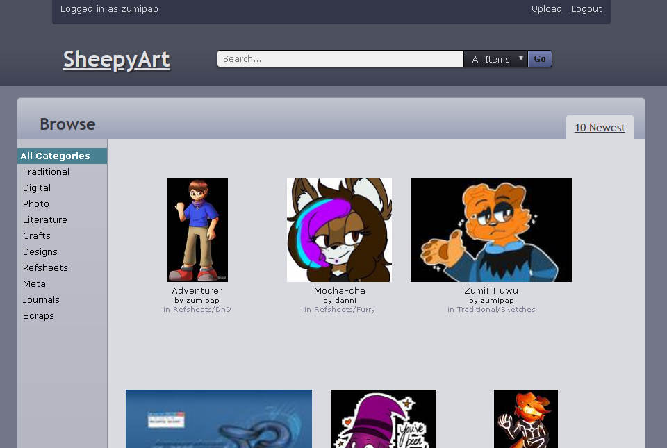

# SheepyArt

## What
This is a Flask application, basically a ripoff of classic DeviantArt.

It's pretty awful, but it's a practice / crashcourse app. About the same
excuse as me making MS Paint art and calling that my art style... but
I find this pretty interesting to write out anyway.

It's supposed to look like the 2008 layout, but even I don't remember
what that looked like. It might end up looking like an amalgamation of
2008 and 2010 dA. The VidLii of DeviantArt? nah.

It doesn't do much right now. You can only register, login and upload stuff.
That's it. Watch as your masterpiece floats away in the browse screen...
because there's no next page yet. Will get to it eventually. Orientation's
right around the corner.

## What it Looks like
Not much right now.

## Working Features
  * Basic user authentication (registration, login, logout)
  * Image upload and thumbnailing
  * User gallery and global gallery
  * Basic configuration through `definitions.json`
  * Configurable color scheme, just edit `$theme-color` in `assets/scss/main/main.scss`
  * Basic search support (tags included)
  * Browsing categories and seeking by offset
  * Editing and deleting art
  * Markdown support

## Missing from the Big Picture
  * Comments
  * Critiques
  * Collections, favorites and views
  * Trending tab
  * Literature and journal/blogs.
  * User bio and other user info
  * Avatar and user settings
  * Notifications, inbox
  * Literally everything else

## Missing from the Small Picture
  * Logging in by e-mail address
  * Country selection and inclusion on userpage
  * Subcategory display on the sidebar
  * Tags looking like hashtags, each being a separate link to the search query

## Oddities
  * Importing global objects need to be done from `sheepyart.sheepyart`
  * Database located at `rootdir/sheepyart/base.db`, definitions file located at `rootdir/sheepyart/app/definitions.json`
  * The logs are located at `rootdir/sheepyart.log`
  * Search indexes located at `rootdir/sheepyart_search`
  * Migration is in `rootdir/migrations`

## Known Bugs
  * Upload doesn't handle no-file-selected cases yet
  * Seach function might be slow? (might affect art uploads)
  * Manually uploading the art file when editing an entry, regardless of intent
  * Possible unhandled errors and conditions

## What to install first
Core dependencies
  * Python 3.7+
  * Pipenv (make sure it's the Python 3 pipenv!)

PIL dependencies
  * libjpeg (`libjpeg-dev` in Debian and descendants)
  * zlib (`zlib1g-dev` in Debian and descendants)
  * ffi (`libffi-dev` in Debian and descendants)

## Run
  * Run `pipenv install`
  * Then `pipenv run python make_db.py`.
  * Then `pipenv run python main.py`.
  * Access the application by going to `http://localhost:8000` once
    it is running.

## Migrations
  * Run `pipenv run python migrate.py db migrate` to update the database schemas.
  * Run `pipenv run python migrate.py db upgrate` to migrate the database.
