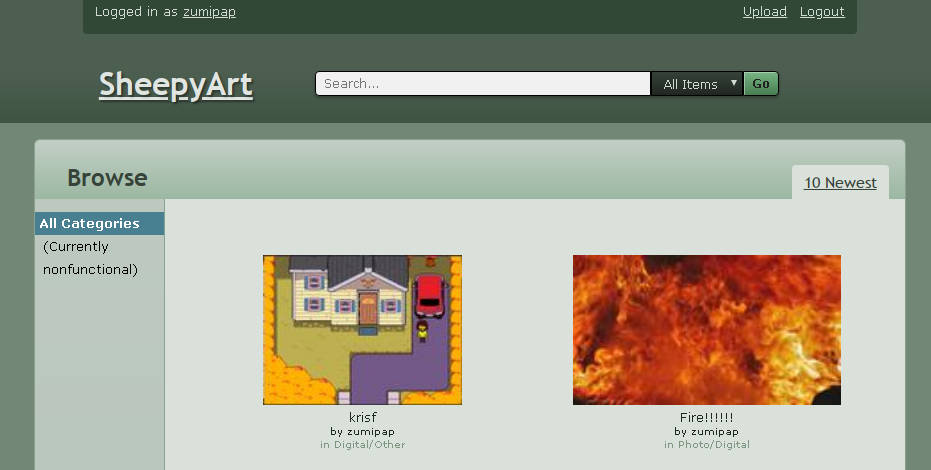

# SheepyArt

## What
This is a Flask application, basically a ripoff of classic DeviantArt.

It's pretty awful, but it's a practice / crashcourse app. About the same
excuse as me making MS Paint art and calling that my art style... but
I find this pretty interesting to write out anyway.

It's supposed to look like the 2008 layout, but even I don't remember
what that looked like. It might end up looking like an amalgamation of
2008 and 2010 dA. The VidLii of DeviantArt? nah.

## What it Looks like
Not much right now. (this is not the default color scheme)

## Working Features
  * Basic user authentication (registration, login, logout)
  * Basic image upload and thumbnailing
  * User gallery and global gallery
  * Basic configuration through `definitions.json`
  * Configurable color scheme, just edit `$theme-color` in `assets/scss/main/main.scss`

## Missing from the Big Picture
  * Collections, favorites and views
  * Trending tab (see above)
  * Search and tags
  * Browsing categories and seeking by offset
  * Edit and delete art
  * Literature and journal/blogs.
  * User bio and other user info
  * Notifications, inbox

## Missing from the Small Picture
  * Logging in by e-mail address
  * Country selection and inclusion on userpage
  * User gallery
  * Markdown support

## Oddities
  * Importing global objects need to be done from `sheepyart.sheepyart`
  * Database located at `sheepyart/base.db`, definitions file located at `sheepyart/app/definitions.json`
  * The logs are located at rootdir/`sheepyart.log`

## Known Bugs
  * Upload doesn't handle no-file-selected cases yet
  * Will need to check user input sanitizing (use a global config?)

## What to install first
Core dependencies
  * Python 3.7+
  * Pipenv (make sure it's the Python 3 pipenv!)

PIL dependencies
  * libjpeg (`libjpeg-dev` in Debian and descendants)
  * zlib (`zlib1g-dev` in Debian and descendants)
  * ffi (`libffi-dev` in Debian and descendants)

## Run
  * Run `pipenv install`
  * Then `pipenv run python make_db.py`.
  * Then `pipenv run python main.py`.
  * Access the application by going to `http://localhost:8000` once
    it is running.
